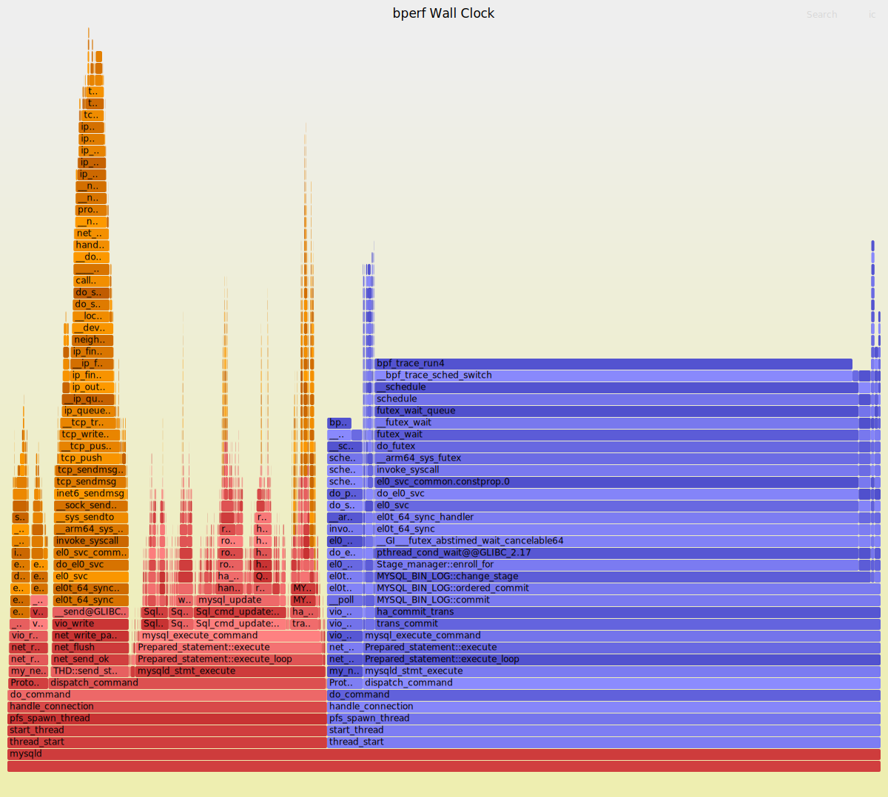

# bperf -- Unified On/Off-CPU Profiler

bperf captures **on-CPU** and **off-CPU** profiling data in a single recording
session using eBPF. It writes a standard `perf.data` file readable by
unmodified `perf report`, `perf script`, and flame graph tools.

Traditional profilers force a choice: `perf record -e task-clock` sees only
on-CPU activity, while off-CPU tools like `offcputime` see only blocking time.
Neither answers the question *"where does my application spend its wall-clock
time?"* bperf captures both, classifies off-CPU reasons (runqueue wait, I/O
wait, interruptible/uninterruptible sleep), and merges everything into a single
**wall-clock** event.

The concept originates from the [bperf paper](https://github.com/s3yonsei/blocked_samples)
(OSDI '24, Yonsei University), which introduced blocked samples via kernel
patches to Linux. This implementation achieves the same profiling capability
using eBPF on stock kernels -- no kernel patches required.



*Two-tone wall-clock flamegraph for MySQl (one connection thread).*

## How It Works

- **On-CPU**: `perf_event_open(task-clock)` samples at a configurable frequency
- **Off-CPU**: BPF program on `tp_btf/sched_switch` captures every blocking
  episode with kernel + user stacks and duration
- Both streams share `CLOCK_MONOTONIC` timestamps and are merged into a single
  perf.data with one unified `wall-clock` event attribute

See [DESIGN.md](DESIGN.md) for the full architecture, BPF program details,
and perf.data output format.

## Requirements

| Requirement | Minimum | Tested With |
|---|---|---|
| Linux kernel | 6.1+ with BTF | 6.8.0-106-generic (aarch64) |
| `CONFIG_DEBUG_INFO_BTF` | `=y` | Required for CO-RE / `tp_btf` |
| `CONFIG_BPF_SYSCALL` | `=y` | Required for BPF |
| clang/llvm | 14+ | clang-18, llvm-18 |
| libbpf | 1.0+ | 1.3.0 (libbpf-dev) |
| libelf | any | libelf-dev |
| bpftool | 5.15+ | 7.4.0 |

**Architecture:** Tested on aarch64 (ARM). Should work on x86_64 without
changes (the Makefile auto-detects `uname -m`).

## Build

### Install dependencies

Ubuntu/Debian:

```bash
sudo apt-get install -y \
    clang-18 llvm-18 \
    libbpf-dev libelf-dev zlib1g-dev \
    linux-tools-common bpftool
```

If `bpftool` is not available as a package, it can be built from the kernel
source tree (`tools/bpf/bpftool`).

### Generate vmlinux.h

This header provides BTF type definitions for CO-RE. Generate it once from the
running kernel:

```bash
bpftool btf dump file /sys/kernel/btf/vmlinux format c > vmlinux.h
```

It must be regenerated if you move to a different kernel version.

### Compile

```bash
make -j16
```

This compiles the BPF program, generates the BPF skeleton, and links the
userspace binary. Output: `./bperf`.

## Usage

```
bperf record [OPTIONS] [-- command [args...]]

OPTIONS:
    -p, --pid <PID>         Profile a specific process (all threads if TGID, one thread if TID)
    -t, --tid <TID>         Alias for -p
    -a, --all-cpus          System-wide profiling
    -F, --freq <HZ>         On-CPU sampling frequency [default: 99]
    --no-kernel             Exclude kernel call chains
    --min-block <USEC>      Minimum off-CPU duration to record [default: 1]
    -d, --duration <SEC>    Recording duration [default: until Ctrl-C]
    -o, --output <FILE>     Output file [default: bperf.data]
    --stack-depth <N>       Maximum stack depth [default: 127]
    --ringbuf-size <MB>     BPF ring buffer size [default: 16]
    --no-flamegraph         Skip SVG flamegraph generation
```

Root (or `CAP_BPF` + `CAP_PERFMON`) is required for BPF and `perf_event_open`.

### Examples

```bash
# Profile a running thread for 30 seconds
sudo ./bperf record -t 12345 -F 99 -d 30

# System-wide for 10 seconds
sudo ./bperf record -a -d 10 -o system.data

# Launch and profile a command
sudo ./bperf record -- ./my_server --config server.conf

# Skip flamegraph generation
sudo ./bperf record --no-flamegraph -p 12345 -d 10
```

### Tip: profiling multi-threaded processes

For processes that spread work across many threads (databases, web servers,
thread pools), profiling the whole process with `-p TGID` aggregates all
threads into one flamegraph. This can obscure the bottleneck: a worker thread
blocked on I/O is buried among dozens of idle threads, diluting its signal.

**Recommendation**: identify the thread doing the work you care about and
profile it directly with `-t TID`. This gives a clean wall-clock view of
exactly that thread's on-CPU and off-CPU activity with no noise from unrelated
threads.

```bash
# Find threads of a process and their CPU usage
ps -T -p <PID> -o tid,comm,%cpu --sort=-%cpu | head -20

# Profile the busiest worker thread specifically
sudo ./bperf record -t <TID> -d 30
```

Whole-process mode (`-p TGID`) is still useful for getting an overview or when
you do not know which thread to focus on yet.

### Viewing results

```bash
# Interactive report
perf report -i bperf.data

# Raw event dump
perf script -i bperf.data | head -40
```

The output SVG flamegraph is written next to the data file (e.g.,
`bperf.data.svg`). Open it in any browser for an interactive wall-clock
flamegraph with two-tone coloring (red = on-CPU, blue = off-CPU).

## Quick Test

Build and run the included test workload:

```bash
gcc -O2 -fno-omit-frame-pointer -o test_workload test_workload.c -lm
sudo ./bperf record -F 99 -o bperf.data -- ./test_workload
```

Expected output:

```
bperf: profiling command './test_workload' (pid 12345)
bperf: recording... press Ctrl-C to stop
test_workload: 10 rounds of CPU work + sleep
test_workload: done
bperf: stopping...
bperf: on-CPU samples: 48
bperf: off-CPU events: 363
bperf: output written to bperf.data
bperf: generating flamegraph...
bperf: flamegraph written to bperf.data.svg
```

## Notes

- **Frame pointers**: For accurate user-space stacks, compile your target with
  `-fno-omit-frame-pointer`. The test workload already uses this flag.
- **Kernel symbols**: If `perf report` shows `[unknown]` for kernel symbols,
  run `echo 0 | sudo tee /proc/sys/kernel/kptr_restrict`.
- The bundled `flamegraph/` directory contains scripts from Brendan Gregg's
  [FlameGraph](https://github.com/brendangregg/FlameGraph) project. `perl`
  and `perf` must be installed for flamegraph generation. Please note it's
  modified to fit this project.

## Project Structure

```
bperf/
├── DESIGN.md               # Architecture and perf.data format details
├── Makefile                 # Build system
├── vmlinux.h               # Generated: BTF header for CO-RE
├── test_workload.c          # Test program (CPU work + nanosleep cycles)
├── include/
│   ├── bperf_common.h      # Shared structs between BPF and userspace
│   └── perf_file.h          # perf.data format definitions
├── src/
│   ├── bperf.bpf.c          # BPF program (tp_btf/sched_switch handler)
│   ├── bperf.c              # CLI entry point, argument parsing
│   ├── record.c / record.h  # Recording orchestration
│   ├── oncpu.c / oncpu.h    # On-CPU: perf_event_open, mmap ring buffer
│   ├── offcpu.c / offcpu.h  # Off-CPU: BPF skeleton loader, ringbuf consumer
│   ├── writer.c / writer.h  # perf.data file writer
│   └── proc.c / proc.h      # /proc parser (maps, comm, threads)
└── flamegraph/
    ├── stackcollapse-perf.pl # Collapse perf script output to folded stacks
    └── flamegraph.pl         # Render folded stacks as interactive SVG
```

## Credits

This project builds on ideas and tools from:

- **bperf / blocked_samples** (OSDI '24, Yonsei University) -- the original
  blocked-samples profiling concept and kernel implementation
  ([paper & code](https://github.com/s3yonsei/blocked_samples),
  [kernel patches](https://github.com/s3yonsei/linux-blocked_samples))
- **FlameGraph** by Brendan Gregg -- flame graph visualization scripts
  ([github](https://github.com/brendangregg/FlameGraph), CDDL-1.0 license)
- **libbpf** / **BPF CO-RE** -- the eBPF library and compile-once-run-everywhere
  framework that makes this work on stock kernels
- **perf** (Linux `tools/perf`) -- the standard profiling infrastructure whose
  file format and tools we target

Code and documentation were written with
[OpenCode](https://github.com/anomalyco/opencode) + Claude Opus 4.6.
